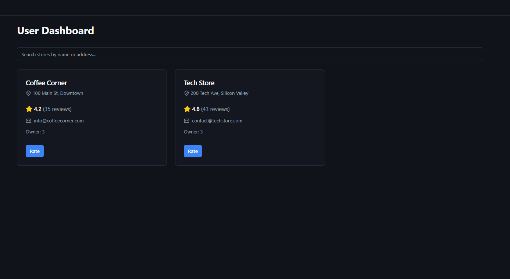
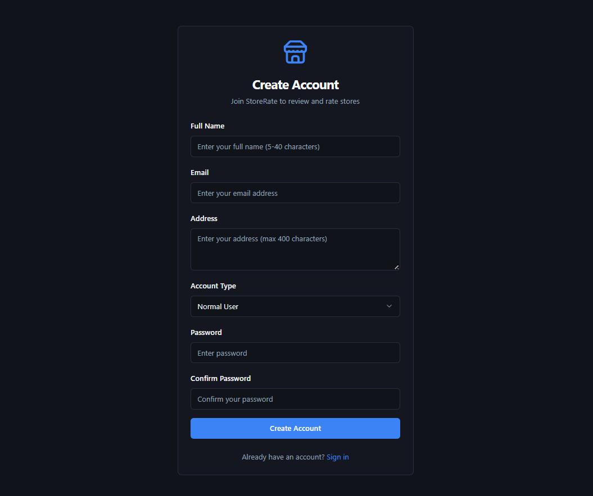

# 🌟 FullStack Store Rating System

A dynamic **full-stack web application** built as part of the *FullStack Intern Coding Challenge*.  
This system enables users to **register, log in, and rate stores** (ratings: 1–5).  
It features a **single login system** with role-based access for:  

- 🛠️ **System Administrator**  
- 👨‍💻 **Normal User**  
- 🛒 **Store Owner**  

Each role is provided with **tailored functionalities**, ensuring a secure and seamless experience.

<<<<<<< HEAD

=======
---
>>>>>>> f9d6f4176e8b71e4c08933da23d8d19121c7307a

## 🚀 Tech Stack
- **Frontend:** React.js (React Router, Hooks, TailwindCSS/Vite)  
- **Backend:** Node.js with Express.js (Knex.js for DB operations)  
- **Database:** MySQL  
- **Authentication:** JWT with bcrypt  
- **Validation:** express-validator / Joi (backend) + custom validation (frontend)  

<<<<<<< HEAD

=======
---
>>>>>>> f9d6f4176e8b71e4c08933da23d8d19121c7307a

## 🔑 Features

### 🛠️ System Administrator
- Add new **stores**, **normal users**, and **admin users**  
- Dashboard displaying:
  - Total users
  - Total stores
  - Total ratings submitted  
- Add users with details: **Name, Email, Password, Address**  
- View list of stores (Name, Email, Address, Rating)  
- View list of users (Name, Email, Address, Role)  
- Filter listings (by Name, Email, Address, Role)  
- View detailed profiles (with Store Owner’s average rating)  
- Logout securely  

<<<<<<< HEAD

=======
---
>>>>>>> f9d6f4176e8b71e4c08933da23d8d19121c7307a

### 👨‍💻 Normal User
- Register & log in  
- Update password after login  
- View and search registered stores by **Name & Address**  
- Store listing includes:
  - Store Name
  - Address
  - Overall Rating
  - User’s Submitted Rating  
- Submit or modify ratings (1–5) for stores  
- Logout securely  

<<<<<<< HEAD

=======
---
>>>>>>> f9d6f4176e8b71e4c08933da23d8d19121c7307a

### 🛒 Store Owner
- Log in & update password  
- Dashboard includes:
  - Users who rated their store
  - Average store rating  
- Logout securely  

<<<<<<< HEAD

=======
---
>>>>>>> f9d6f4176e8b71e4c08933da23d8d19121c7307a

## 🗂️ Project Structure

### 📦 Root Structure
```

Store-Rating-Application/
│
├── backend/          # Node.js + Express.js APIs
├── frontend/         # React.js application
├── database/         # SQL schema & migrations
├── docs/             # Documentation (ERD, Postman collection, screenshots)
└── README.md         # Main project documentation


### ⚙️ Backend Structure


backend/
├── src/
│   ├── config/
│   │   └── database.js          # Knex configuration
│   ├── controllers/
│   │   ├── authController.js
│   │   ├── ratingController.js
│   │   ├── storeController.js
│   │   └── userController.js
│   ├── middleware/
│   │   ├── auth.js              # JWT authentication middleware
│   │   └── roleAuth.js          # Role-based access control
│   ├── models/
│   │   ├── Rating.js
│   │   ├── Store.js
│   │   └── User.js
│   ├── routes/
│   │   ├── authRoutes.js
│   │   ├── ratingRoutes.js
│   │   ├── storeRoutes.js
│   │   └── userRoutes.js
│   ├── utils/
│   │   └── validation.js        # Form validations
│   ├── app.js
│   └── server.js
│
├── database/
│   └── migrations/
│       └── 202509100148\_create\_tables.js
│
├── .env
├── .gitignore
├── package-lock.json
└── package.json


### 🎨 Frontend Structure


frontend/
├── src/
│   ├── assets/                  # Images, icons
│   ├── components/              # Reusable components (Navbar, Footer, Forms)
│   ├── pages/                   # Role-based pages (Login, Signup, Dashboard, Stores)
│   ├── context/                 # Context API / State management
│   ├── services/                # API service calls (Axios)
│   ├── utils/                   # Helper functions & validation
│   ├── App.js                   # Main entry point
│   └── index.js
│
├── public/
│   └── index.html
├── package.json
└── vite.config.js (if using Vite)


## 💾 Database Setup

- **Database:** MySQL  
- **Migration Command:**  
```bash
npx knex migrate:latest


* **.env Example:**


DB_HOST=localhost
DB_USER=root
DB_PASSWORD=Recruter@123
DB_NAME=store_rating_db
JWT_SECRET=your_jwt_secret
PORT=5000

* **Schema Highlights:**

  * **users:** id, name (20–60 chars), email, password (8–16 chars w/ uppercase + special char), address (≤400 chars), role (admin/user/store\_owner)
  * **stores:** id, name, email, address, owner\_id, average\_rating (0–5)
  * **ratings:** id, user\_id, store\_id, rating (1–5), unique (user\_id + store\_id)

* **Validation:** handled in `utils/validation.js` (backend) & React forms (frontend).


## 📸 Screenshots

### Dashboard Preview



### Main User Interface




## 🚧 Getting Started

### 🔧 Prerequisites

* Node.js & npm installed
* MySQL server running
* Git (for cloning the repo)

#### Backend Setup

bash
cd backend
npm install
cp .env.example .env    # configure DB credentials
npx knex migrate:latest
npm run dev

#### Frontend Setup

bash
cd frontend
npm install
npm run dev


👉 The app will be available at:
**Frontend:** [http://localhost:3000](http://localhost:3000)
**Backend API:** [http://localhost:5000](http://localhost:5000)


## ✨ Author

👨‍💻 Developed by Hiteshri Gautam
🔗 [Linkedin.com/in/aftab-ali-181194276](https://linkedin.com/in/hiteshri-gautam-3041a92b4)) 
